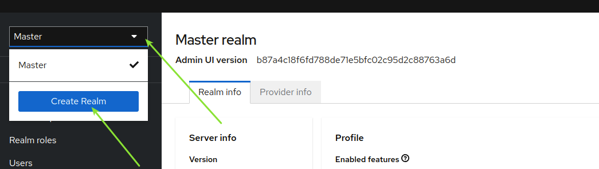
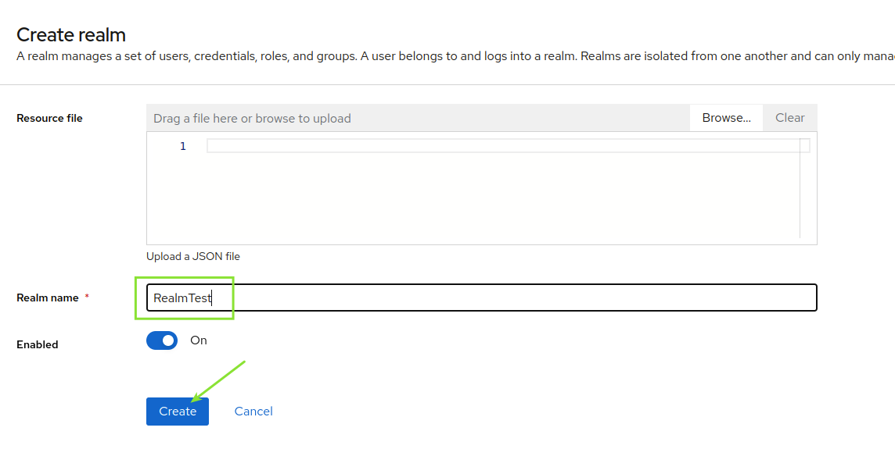
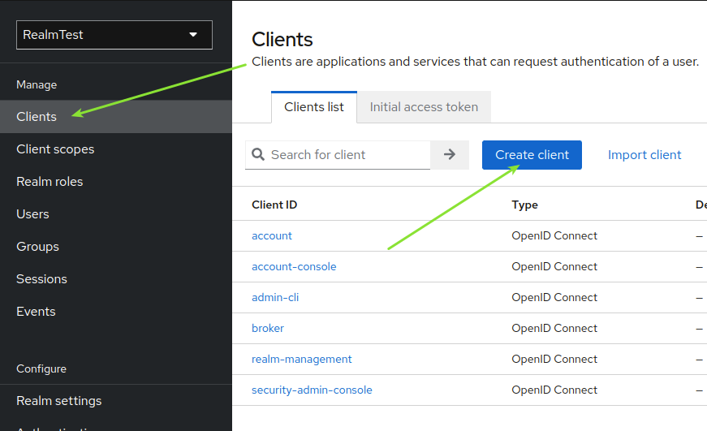
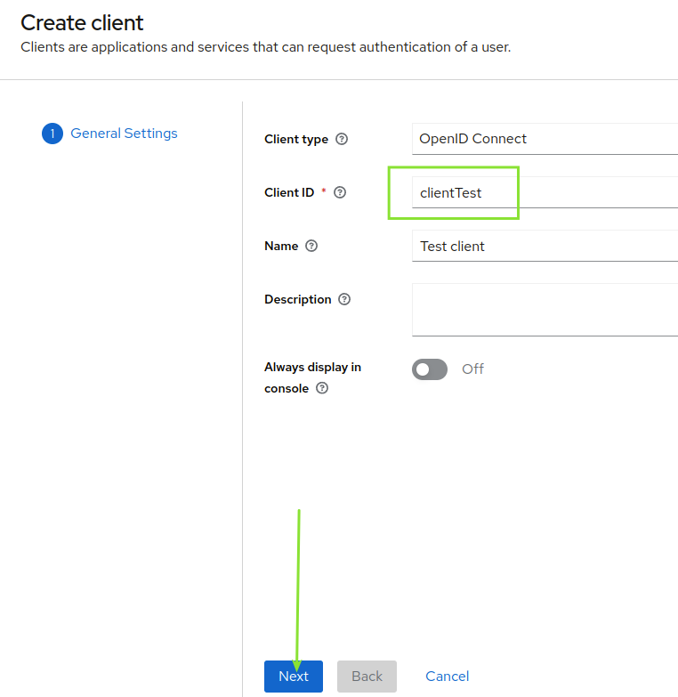
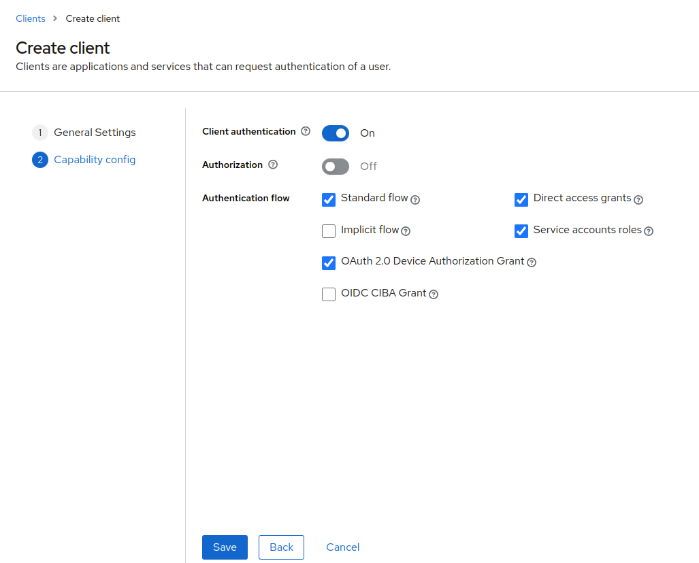
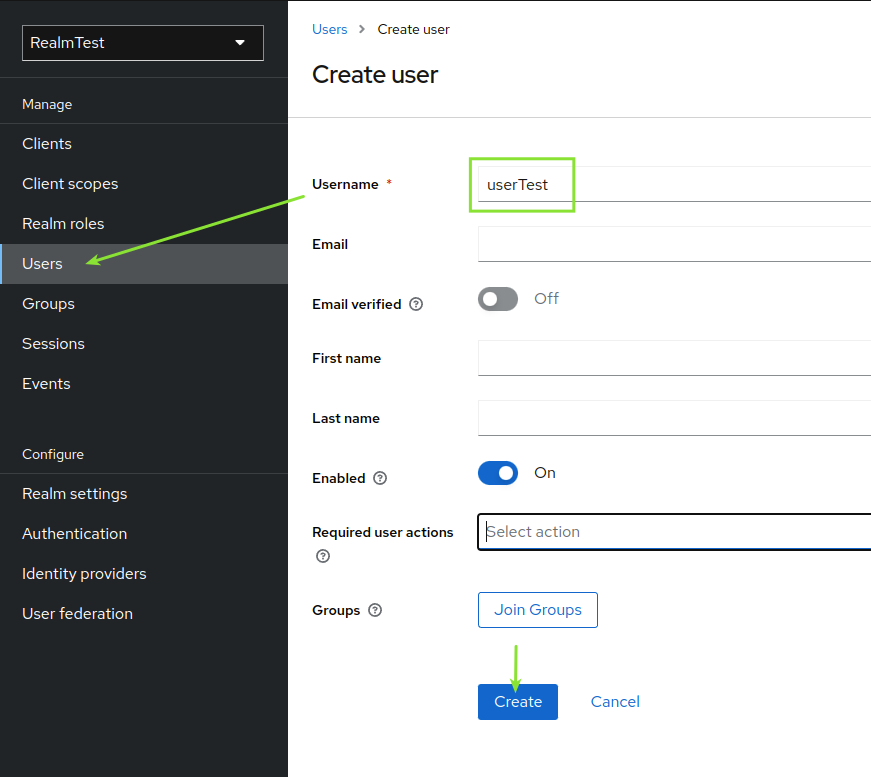
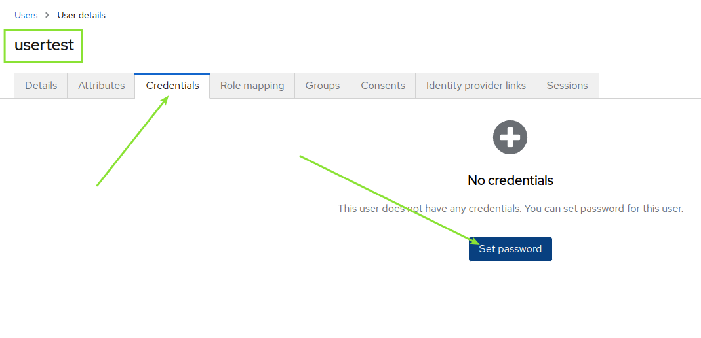
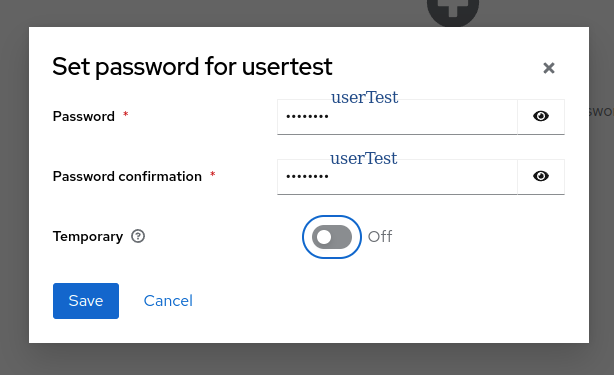
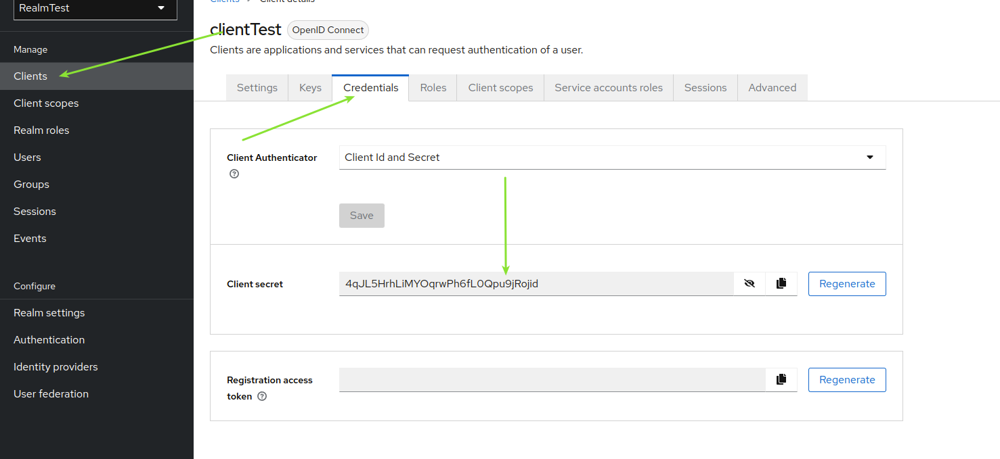

# Keycloak 19 with POSTGRE

## Introducción

En esta POC vamos a tratar de explicar cómo crear a nivel de docker un identity manager como es Keycloak, el cuál está asociado a una base de datos POSTGRE. Se detallará a nivel de docker-compose cómo se hará la instalación del propio identity manager y la instancia de Postgre asociada, y también se explicará cómo crear un Realm, client, y usuario para probar la recepción de un token válido.

## Archivos necesarios

### docker-compose.yml

En el docker-compose que se muestra a continuación se va a realizar la creación de un contenedor de Keycloak en su versión 19, y, además, se creará una base de datos postgre versión 15. 

Además, cuando creemos la base de datos, a su vez en la creación del contenedor, se creará un usuario, constraseña y base de datos exclusivos para Keycloak.

```
version: '3.9'

services:
  db:
    image: postgres:15.0
    ports:
      - "5441:5432"
    volumes:      
      - postgres-data:/var/lib/postgresql/data
      - ./initdb:/docker-entrypoint-initdb.d
    environment:
      POSTGRES_USER: admin_user
      POSTGRES_PASSWORD: admin_password
      POSTGRES_DB: admin_db
      POSTGRES_USER_NEW: keycloak_db_user
      POSTGRES_PASSWORD_NEW: keycloak_db_password
      POSTGRES_DB_NEW: keycloak_db

  keycloak:
    image: quay.io/keycloak/keycloak:19.0.3
    environment:
      DB_VENDOR: postgres
      DB_ADDR: keycloak_db
      DB_USER: keycloak_db_user
      DB_PASSWORD: keycloak_db_password
      KEYCLOAK_ADMIN: admin
      KEYCLOAK_ADMIN_PASSWORD: admin
    ports:
      - 8091:8080
    depends_on:
      - db
    command:
      - start-dev

volumes:
  postgres-data:
```

### init.sql

Como podemos observar en el repositorio, además del archivo docker-compose se adjunta una carpeta denominada initdb en la cuál se encuentra un arichivo init.sql con el siguiente contenido:

```
CREATE USER keycloak_db_user WITH PASSWORD 'keycloak_db_password';
CREATE DATABASE keycloak_db;
GRANT ALL PRIVILEGES ON DATABASE keycloak_db TO keycloak_db_user;
```

En este archivo, se crea un usuario y una base de datos asociada al propio usuario que se acaba de crear.

## Lanzamiento docker-compose

Ejecutamos el archivo docker-compose que se ha definido en una terminal

```
docker-compose up -d
```

## Configurando Keycloak

### Acceso a keycloak

En una ventana de navegador, ingresamos la siguiente URL

**http://localhost:8091/**

**Usuario:** admin | **Contraseña:** admin

### Creación de REALM

Creamos un Realm nuevo que se llamará RealmTest





### Creación de Cliente

Una vez creado el Realm, creamos un client nuevo para este Realm







### Creación de usuario asociado a cliente

Ya con el client creado en el RealmTest, crearemos un usuario nuevo con constraseña sin expiración.







## Solicitud de token

En una terminal, hacemos la petición vía cURL de la siguiente manera, y así, obtendremos el token.

```
curl -d 'client_id=clientTest' -d 'client_secret=4qJL5HrhLiMYOqrwPh6fL0Qpu9jRojid' -d 'username=userTest' -d 'password=userTest' -d 'grant_type=password' 'http://localhost:8091/realms/RealmTest/protocol/openid-connect/token'
```

La respuesta será similar a la siguiente:

{"access_token":"eyJhbGciOiJSUzI1NiIsInR5cCIgOiAiSldUIiwia2lkIiA6ICJxV2Rwczhic2ptOHNuOGVEalBacExfeGRvSG5pWHN0bXpFVHlGZEc5dHQ4In0.eyJleHAiOjE2ODE1NzIwNjUsImlhdCI6MTY4MTU3MTc2NSwianRpIjoiZjFhOWNkNzYtOWYzZi00OWM1LWEyMWMtNWI0OTQ2NmQ4YzcwIiwiaXNzIjoiaHR0cDovL2xvY2FsaG9zdDo4MDkxL3JlYWxtcy9SZWFsbVRlc3QiLCJhdWQiOiJhY2NvdW50Iiwic3ViIjoiNTQwZTdmNjItZDQ3Ni00MDg3LTk0ZDctZWYzZjQwYzI3MGZmIiwidHlwIjoiQmVhcmVyIiwiYXpwIjoiY2xpZW50VGVzdCIsInNlc3Npb25fc3RhdGUiOiI4MzQzNzMzZi02ZjFlLTQ5OWMtYmJhYy1hMDYzODBlZjQ2ZmUiLCJhY3IiOiIxIiwicmVhbG1fYWNjZXNzIjp7InJvbGVzIjpbIm9mZmxpbmVfYWNjZXNzIiwiZGVmYXVsdC1yb2xlcy1yZWFsbXRlc3QiLCJ1bWFfYXV0aG9yaXphdGlvbiJdfSwicmVzb3VyY2VfYWNjZXNzIjp7ImFjY291bnQiOnsicm9sZXMiOlsibWFuYWdlLWFjY291bnQiLCJtYW5hZ2UtYWNjb3VudC1saW5rcyIsInZpZXctcHJvZmlsZSJdfX0sInNjb3BlIjoiZW1haWwgcHJvZmlsZSIsInNpZCI6IjgzNDM3MzNmLTZmMWUtNDk5Yy1iYmFjLWEwNjM4MGVmNDZmZSIsImVtYWlsX3ZlcmlmaWVkIjpmYWxzZSwicHJlZmVycmVkX3VzZXJuYW1lIjoidXNlcnRlc3QiLCJnaXZlbl9uYW1lIjoiIiwiZmFtaWx5X25hbWUiOiIifQ.QJGSRlRZLYGx9-jsu9VZmrxmnMi7wVbwkEArzmblWhAiEoIF8Q9UmiaCl3p2MaCVaL5aX0Cj_N5uz5q8jc3ok7iYFqzDt_UeL_v748etvmSI7ErD9V3jQOpcR4au-x9psYr7SKSFT9szSQMt4bNHvY_EDe2YDM5adiP7eGbFVYmCB_3C-dlNTfCn61Uy8WE1uvAxj-seaWg1n8e2FTjWiCmsY6ySUaDndZ0TszuEGl6l_agVZScx8Egee03HJ-Abg2OQElOoVJFuya_6y6ojxOQ4k10OjuwN1grmwaDzssVxRDe0rAF71afrcTvf0VPxjUL_AwahB8EaH93Lk2QNkg","expires_in":300,"refresh_expires_in":1800,"refresh_token":"eyJhbGciOiJIUzI1NiIsInR5cCIgOiAiSldUIiwia2lkIiA6ICJlN2MxNWM3Yy05YjJhLTRhOTctOGEwOS1lOWZmMTIzYjlkMDEifQ.eyJleHAiOjE2ODE1NzM1NjUsImlhdCI6MTY4MTU3MTc2NSwianRpIjoiYTU3MDY3ZjYtM2E4Yi00ZWRlLWFlMzEtMzlmMjk2NjE3N2JhIiwiaXNzIjoiaHR0cDovL2xvY2FsaG9zdDo4MDkxL3JlYWxtcy9SZWFsbVRlc3QiLCJhdWQiOiJodHRwOi8vbG9jYWxob3N0OjgwOTEvcmVhbG1zL1JlYWxtVGVzdCIsInN1YiI6IjU0MGU3ZjYyLWQ0NzYtNDA4Ny05NGQ3LWVmM2Y0MGMyNzBmZiIsInR5cCI6IlJlZnJlc2giLCJhenAiOiJjbGllbnRUZXN0Iiwic2Vzc2lvbl9zdGF0ZSI6IjgzNDM3MzNmLTZmMWUtNDk5Yy1iYmFjLWEwNjM4MGVmNDZmZSIsInNjb3BlIjoiZW1haWwgcHJvZmlsZSIsInNpZCI6IjgzNDM3MzNmLTZmMWUtNDk5Yy1iYmFjLWEwNjM4MGVmNDZmZSJ9.RK21iqKVwuzL5r0CjYR2lIx1VHvffiqCpDaS-kMZVDk","token_type":"Bearer","not-before-policy":0,"session_state":"8343733f-6f1e-499c-bbac-a06380ef46fe","scope":"email profile"}

Siendo la variable **access_token** el token de acceso que usaremos en una aplicación.

**Como se puede observar en la petición del token, hace falta informar el parámetro "client_secret" en la petición. Para ello, consultaremos dicho este secret en el client que configuramos en pasos anteriores**



